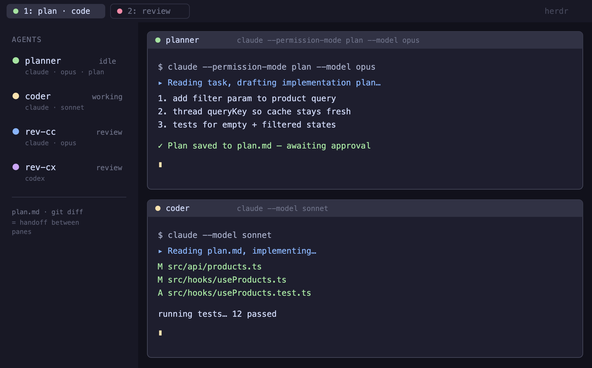

# Plan → Code → Review (herdr plugin)

Opens a four-agent workflow with one herdr action: **Opus plans, Sonnet codes,
Claude (Opus) + Codex review.** herdr manages only the panes and their state
(`idle` / `working` / `blocked`); the model and role of each pane are set by its
launch command. Handoff between panes happens through the filesystem
(`plan.md`, `git diff`).



| Pane      | Location    | Command                                        | Role            |
| --------- | ----------- | ---------------------------------------------- | --------------- |
| `planner` | current tab | `claude --permission-mode plan --model opus`   | plan → plan.md  |
| `coder`   | current tab | `claude --model sonnet`                          | implement plan  |
| `rev-cc`  | review tab  | `claude --model opus`                            | review git diff |
| `rev-cx`  | review tab  | `codex`                                          | review git diff |

Two independent reviewers (Claude + Codex) on the same diff catch different
classes of issues — coverage, not redundancy. Running them in separate panes
also keeps their contexts independent, which avoids the self-review bias of
asking the coding session to review its own work.

A separate, optional feature — [subagent viewer panes](#subagent-viewer-panes)
— surfaces the subagents `claude` spawns as their own live panes.

## Requirements

- herdr ≥ 0.7.0
- `jq` — the actions parse herdr's JSON output with it
- `claude` and `codex` on `PATH` — the panes launch these
- `git` — only for the opt-in auto-handoff diff fingerprint
- for `setup-subagent-panes` only: a Claude Code version that emits the
  `SubagentStart` / `SubagentStop` hook events

## Install

```bash
herdr plugin install inxx/herdr-plan-code-review
```

To hack on it locally, clone and link:

```bash
git clone https://github.com/inxx/herdr-plan-code-review
herdr plugin link ./herdr-plan-code-review
```

## Actions

- **`layout`** — opens the four panes (idempotent: existing panes are reused).
  - UI: right-click a workspace/tab → "Plan → Code → Review layout"
  - CLI: `herdr plugin action invoke plan-code-review.layout`
- **`review`** — the review handoff. Ensures `rev-cc` / `rev-cx` exist and
  **types** the review prompt into both panes. `agent send` does not press
  Enter, so you eyeball the diff and hit Enter yourself (a safety checkpoint).
  - CLI: `herdr plugin action invoke plan-code-review.review`
- **`collect`** — reads both reviewers' recent output (`herdr agent read`) and
  writes them to one file so you merge from a single place instead of scrolling
  two panes. Waits for each reviewer to be `idle` first (best-effort) so it
  doesn't capture a half-streamed review.
  - CLI: `herdr plugin action invoke plan-code-review.collect`
  - Output: `$HERDR_PLUGIN_STATE_DIR/reviews.md` (the state dir herdr sets when
    it runs the action; falls back to `/tmp/reviews.md` if run by hand). Line
    count via `PCR_COLLECT_LINES`, default 400.
  - `done` looks like the state to wait on, but herdr rejects it for CLI waits
    ("done is a UI attention state; use idle") — so `collect` waits on `idle`.
- **`setup-subagent-panes`** — one-time install of the Claude Code hooks that
  power the subagent viewer panes (next section). Idempotent; re-run it after
  plugin updates to refresh the installed scripts.
  - CLI: `herdr plugin action invoke plan-code-review.setup-subagent-panes`

## Subagent viewer panes

`claude` runs its subagents (Task/Agent tool — explorers, executors,
reviewers) *inside* the main process, so herdr can't see them as panes. The
`setup-subagent-panes` action installs two Claude Code hooks that fix that:

- **SubagentStart** → opens a viewer pane below the claude pane (same tab, no
  focus steal) that tails the subagent's transcript — its text and tool calls
  stream live.
- **SubagentStop** → closes that pane again.

What the action does:

1. copies `claude-hooks/herdr-subagent-pane.sh` and
   `claude-hooks/herdr-subagent-view.sh` to `~/.claude/hooks/`
2. registers both hooks in `~/.claude/settings.json` — a `.bak-*` backup is
   written before any change, and existing entries are left untouched

Notes:

- Outside a herdr pane (Claude Code Desktop, a plain terminal) the hook is a
  no-op — it keys off the `HERDR_ENV` / `HERDR_PANE_ID` env vars herdr injects
  into its panes, so it's safe to have installed everywhere.
- Hooks are loaded at session start: they apply to **new** `claude` sessions,
  not ones already running.
- Only want some agents as panes? Narrow the `matcher` in settings.json (e.g.
  `executor|reviewer`). Want panes to stay open after the agent finishes?
  Remove the `SubagentStop` entry. Re-running the action restores defaults.
- Uninstall: delete the `SubagentStart` / `SubagentStop` entries from
  `~/.claude/settings.json` and remove the two scripts from `~/.claude/hooks/`.

## Workflow

1. In `planner`, produce a plan and save it to `plan.md` (plan mode never edits files).
2. In `coder` (`herdr agent attach coder`): "read plan.md, implement it, then `git add -A`".
3. Run the `review` action → the prompt is typed into `rev-cc` / `rev-cx` → hit Enter in each.
4. When both reviewers finish, run the `collect` action → both reviews land in
   one `reviews.md` → merge from there: dedupe and sort by severity.

herdr highlights whichever pane is `blocked` in the tab bar, so you attach to
the one that needs you instead of polling four terminals.

## Auto-handoff (opt-in)

When `coder` goes `idle` and the diff has changed, the `review` action is
invoked automatically. Because Claude's `idle` really means "waiting for your
input" (it fires constantly), this is **off by default**; and even when on, the
`review` action only *types* the prompt (it doesn't submit), so a spurious fire
is harmless.

```bash
# enable
touch "$(herdr plugin config-dir plan-code-review)/autohandoff.on"
# disable
rm    "$(herdr plugin config-dir plan-code-review)/autohandoff.on"
```

It won't re-fire on the same diff (a fingerprint is stored in the state dir).

## Overrides (env)

```bash
PLANNER_MODEL=opus CODER_MODEL=sonnet REVIEW_MODEL=opus \
HERDR_REPO=/path/to/repo PCR_REVIEW_PROMPT="..." \
  herdr plugin action invoke plan-code-review.layout
```

Repo resolution order: `HERDR_REPO` → the `coder` pane's cwd → context JSON cwd
→ `$PWD`. If panes open in the wrong directory from the UI, set `HERDR_REPO`.

## Customize

Pane placement, models, the review prompt, and plan mode all live in
`actions/lib.sh` and `actions/*.sh`. The auto-handoff gate is in
`events/on-status.sh`. The subagent viewer panes are in `claude-hooks/` (what
gets installed) and `actions/setup-subagent-panes.sh` (the installer).

> The screenshot is a real herdr capture; project names and paths have been
> replaced with mock data.
